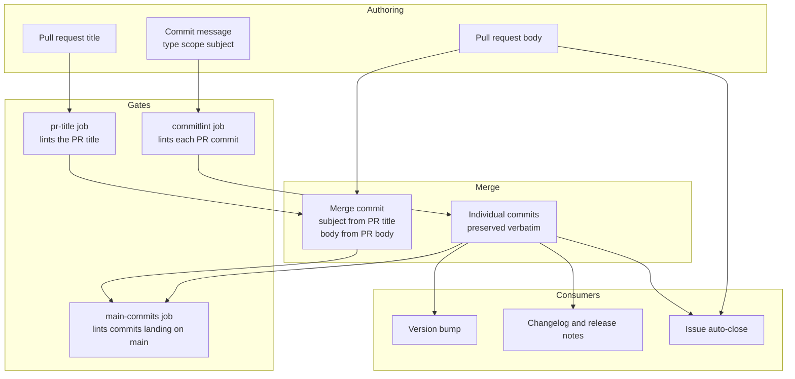
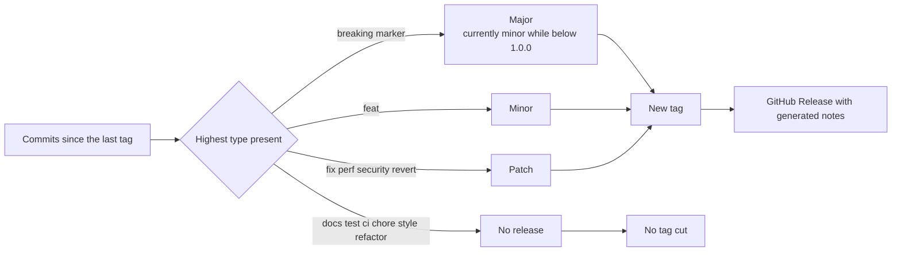

# Commit message workflow

Every message written during development feeds something downstream: a version bump, a
changelog entry, an issue closure, or the permanent history on `main`. This document maps
which message goes where, which gate protects it, and why each gate exists.

The rules themselves live in [`.claude/rules/gitops.md`](../../.claude/rules/gitops.md); this
is the mechanical picture behind them.

## The pipeline

## Which gate covers what

| Message | Gate | Trigger | Why it matters |
| --- | --- | --- | --- |
| Each commit on a PR | `commitlint` | `pull_request` | Type drives the version bump and the changelog group |
| PR title | `pr-title` | `pull_request` including `edited` | Becomes the merge commit subject on `main` |
| Commits landing on `main` | `main-commits` | `push` to `main` | Catches the merge commit and any direct push |

All three run the same validator, `scripts/testing/hooks/check_commit_message.py`, so they
cannot disagree about what a valid message is.

## Why the two newer gates exist

**The PR title was load-bearing and ungated.** The repository sets
`merge_commit_title = PR_TITLE`, so the title becomes the subject of the merge commit that
lands on `main`. The changelog generator and the version bump both read that subject. Until
the `pr-title` job existed, nothing validated it — a mistyped title put a non-conventional
commit on `main` with no gate anywhere in the pipeline. The job includes the `edited` trigger
because a title can be changed after the PR opens, long after the last commit was pushed.

**The merge commit is invisible to a pull request run.** It does not exist until merge time,
so no `pull_request` job can see it. The `main-commits` job runs on pushes to `main` and lints
whatever actually landed. It is a safety net rather than a gate — it reports after the fact —
but it is the only check that sees the merge commit at all, and it also covers commits pushed
directly to `main`, which is possible because `main` is not currently a protected branch.

Merge commits whose subject begins with the word `Merge` are exempt inside the validator, so
this job stays correct whichever way `merge_commit_title` is configured.

## Where the version comes from

The bump is computed from the commits since the most recent tag, not from the PR as a unit.
Because a release is cut on every merge to `main`, that range is exactly one PR's commits, so
in practice each PR produces one version. Skipping a release for a no-release merge means the
next release covers more than one PR and they collapse into a single bump.

The mapping matches `commit-types.yml` in the `ci-templates` repository, which is the
cross-repo source of truth for commit types and their release levels.

## Version history

Tags `v0.1.0` through `v0.8.0` were backfilled onto `main` to reconstruct the version history
from the merge record, one bump per merged pull request in chronological order. They are
annotated and SSH-signed. Before that backfill no tags existed, which meant a changelog
generator had no release boundary to work from and no baseline to bump from.

The project is deliberately below 1.0.0 until the checkpoint ladder is deployed. A breaking
change marker is still written on breaking commits, but below 1.0.0 it produces a minor bump
rather than a major one, which is semver's own guidance for the 0.x series.

## Known gaps

- **Tag signing in CI is unproven.** The backfilled tags were signed locally. No release
  automation has cut a tag yet, and the candidate tooling has no first-class signing option,
  inheriting git configuration instead. See the release tooling issue for the open decision.
- **Merge commits can be double-counted.** With `merge_commit_title = PR_TITLE` the merge
  commit is itself conventional, so a changelog generator sees both it and the commits it
  merges. Setting the title back to the default merge message makes it unconventional, and it
  is then filtered out automatically.
- **`main` is not a protected branch.** The `main-commits` job reports on a bad commit but
  cannot prevent it landing.

## Reference

- [`.claude/rules/gitops.md`](../../.claude/rules/gitops.md) — the binding conventions.
- [`scripts/testing/hooks/check_commit_message.py`](../../scripts/testing/hooks/check_commit_message.py) — the single validator all three gates call.
- [`.github/workflows/commitlint.yml`](../../.github/workflows/commitlint.yml) — the three gates.
- [`cliff.toml`](../../cliff.toml) — commit type to changelog group mapping and the bump rules.
